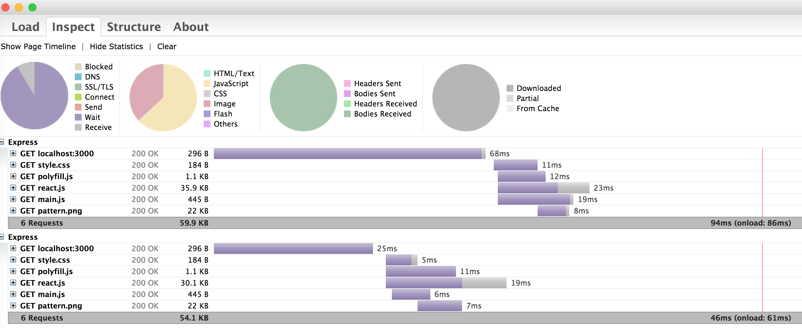

#Render static HTML out of dynamic page

“Google, Facebook, Twitter, Yahoo, and Bing are constantly trying to view your website... but they don't execute javascript.”

Maybe you have used some single page frameworks just like Backbone, React and so on.The question is that your single page applications will look empty in spiders' eyes.

This is a demo shows how you can get HTML out of dynamic page to serve to spiders

## Requirements
Make sure you have installed follow items.

* phantomJS

## Run

``` sh
  $ cd MY_PROJECT
  $ npm install
  $ npm start
```

Then you can open your broswer and input http://localhost:3000.You can see something generated by reactJS.By default, if you run the follow shell,you will get nothing in container div whose id is content.Because curl won't run js.

```sh
$ curl http://localhost:3000/
```

This project is a demo to show how to render HTML content generated by js when the request comes from some agent,that can't run js,such as googlebot,curl and so on.
Under this demo,if you type above shell commond,you can get something like below:

```
<html><head><title>Express</title><link rel="stylesheet" href="/stylesheets/style.css"></head><body><div id="content"><h4 data-reactid=".0">React features!</h4></div></body></html>
```

By default,curl will get content as below:

```
<html><head><title>Express</title><link rel="stylesheet" href="/stylesheets/style.css"></head><body><div id="content"></div></body></html>
```


You can get static HTML for any daymic page just by passing a url to render page url as bellow:

```sh
$ curl http://localhost:3000/render?url=http://localhost:8000/demo.html
```


## Network Monitoring

PhantomJS also can be used to monitor network.This is a demo.To run:

``` sh
  $ npm test
```

This will exports the network traffic in HAR format. Use HAR viewer to visualize the result and get the waterfall diagram.



## Others

There is a project named [prerender](https://github.com/prerender/prerender).Prerender is a node server from prerender.io that uses phantomjs to create static HTML out of a javascript page.
